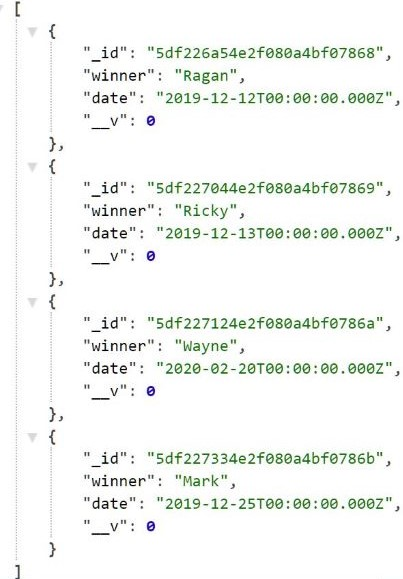

# Kahoot! Tracking API
---


---
## Purpose

This is an Express app to track Kahoot! winners in class.

- If you have no idea what Kahoot is, it's a game-based learning platform, used as educational technology in schools and other educational institutions ([Wikipedia](https://en.wikipedia.org/wiki/Kahoot!)).

- Also check out my favourite Kahoot song  "Drop It Like It's Ka-Hot" here: https://www.youtube.com/watch?v=HbcPNfGlkFc

--- 
## How to Use This App
- __URL__: http://localhost:3000/kahoots

- __Date format__: yyyy-mm-dd

- __Fully CRUD resources__: You can read all the Kahoot records and a single record in browser. You can post a new record, edit and delete a record through Postman.



--- 
## Development Process

### Initial Setting

__1. Create a directory for this project__

```javascript
$ mkdir Kahoot_Tracking
$ cd Kahoot_Tracking
$ npm init -y // 'npm init' to create package.json file. 
//use '-y' at the end of 'npm init' to save time from pressing enter.
```

__2. Install dependencies (production and development)__
- __Express__: Node web server framework to make routing easier and adds a bunch more functionality.
- __Body-parser__: Middleware used to change the data on the request from a steam into usable data available at response.body
- __Method-override__: Let you use HTTP verbs such as PUT or DELETE in places where the client doesn't support it.
- __Mongoose__: Mongoose is a MongoDB object modelling tool designed to work in an asynchronous environment. Mongoose supports both promises and callbacks.
<!-- - [Optional] __Express-handlebar__ - JavaScript templating engine for serving up our html web pages -->

```
$ npm install --save express body-parser method-override mongoose
```
- You can install several dependencies at the same time.
- (After npm 5, you can skip '--save') Refer here for more details about the npm install commands: https://stackoverflow.com/questions/19578796/what-is-the-save-option-for-npm-install

__3. Install development dependencies__
- __Nodemon__: Watches for changes in our JS file and auto restarts our server when it detects them. (Saves us from manually stopping and starting the server).
- __Forever__: Makes sure that if the server crashes it will automatically restart.

```
$ npm install --save-dev nodemon forever 
```

__4. [Important] Create a .gitignore file in root directory__
```
$ touch .gitignore
```
- Write 'node_modules' inside .gitignore, as we don't wanna push our node modules to GitHub 
```
node_modules
```

__5. Set up package.json__
- Create our own npm run script in package.json
- [Optional] Also remember to change your app entry point to 'app.js', as we are creating an 'app.js' file here. By default, the entry point is 'index.js'. You can keep the default name, but remember to name your file as 'index.js'.

```
touch app.js
```

```javascript

"main": "app.js",

"scripts": {
    "server": "forever -c \"nodemon --exitcrash -L\" app.js"
},
```

- After that, we can run our npm script with the following command
```
$ npm run server
```
- [Reminder] If mongoose is installed, you will need to run 'mongod' in a terminal window and then run 'npm run server' in a separate one.

---
### Building CRUD resources

__1. Create basic commands and routes in 'app.js'__

__2. Separate routes into 'routes.js'__
- For full CRUD resources, remember to require 'methodOverride' in 'app.js' so that we can use http verbs other than 'post' and 'get' 
```javascript
const methodOverride = require("method-override")

app.use(methodOverride("_method", { methods: ["POST", "GET"] }))
```

__3. Create 'Controller', and move the business logic from routes.js to controllers\kahoot_controller.js__

__4. Add all the CRUD functions in kahoot_controller.js__

__4. Create Database & Schema__
- Create a folder called 'database'
- Inside 'database', create a folder called 'schemas'
- Inside 'schemas', create a file called 'kahoot_schema.js'

__5. [G's convention] Create Model in a separate folder__
- Inside 'database', create a folder called 'models'
- Inside 'models', create a file called 'kahoot_model.js'

__6. Modify controller & turn your functions to async-await__
- Remember to modify the path to require model in controller
- Remember to use 'try-catch' to handle errors

__7. Create a 'routes' folder, move 'routes.js' inside, and rename it to 'index.js'__

__8. Inside 'routes' folder, create 'kahoot_routes.js' to separate our routes__
